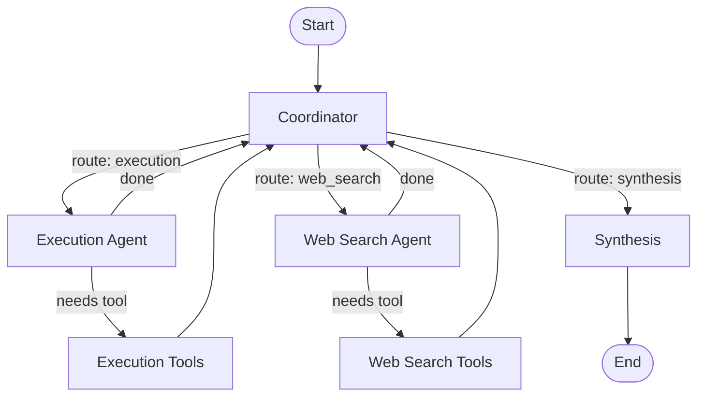

```mermaid
flowchart TD
    START([Start]) --> coordinator[Coordinator]

    coordinator -->|route: execution| execution_agent[Execution Agent]
    coordinator -->|route: web_search| web_search_agent[Web Search Agent]
    coordinator -->|route: synthesis| synthesis[Synthesis]

    execution_agent -->|needs tool| execution_tools[Execution Tools]
    execution_agent -->|done| coordinator
    execution_tools --> coordinator

    web_search_agent -->|needs tool| web_search_tools[Web Search Tools]
    web_search_agent -->|done| coordinator
    web_search_tools --> coordinator

    synthesis --> END([End])
```
